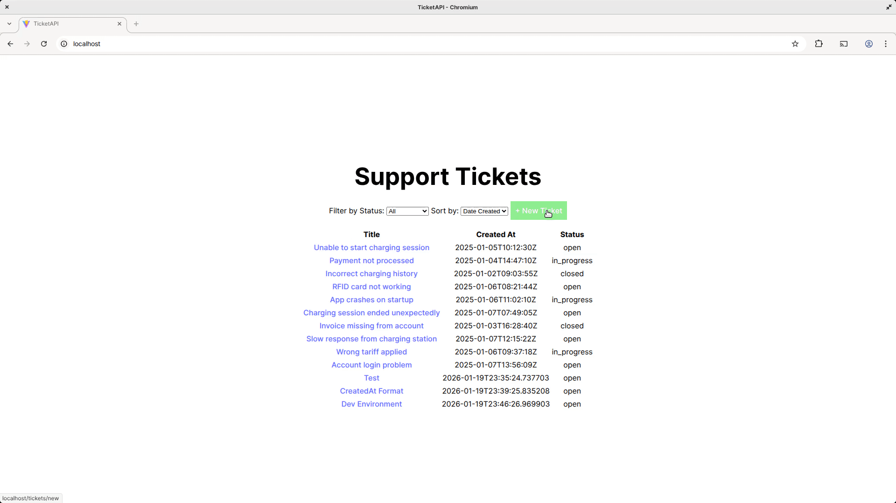

# TicketAPI




## Repository Overview

- [backend/](./backend): FastAPI backend.
  - [app/](./backend/app): Application source code.
    - [main.py](./backend/app/main.py): The main application file.
    - [TicketService.py](./backend/app/TicketService.py): Module handling ticket operations (db, persistence).
    - [TestTicketService.py](./backend/app/TestTicketService.py): Unit tests for TicketService endpoints.
  - [data/tickets.json](./backend/data/tickets.json): Contains the initial ticket data.
  - [Dockerfile](./backend/Dockerfile): Dockerfile for the backend.
- [docs/](./docs): Documentation and frontend integration plan.
  - [demo.ipynb](./docs/demo.ipynb): Jupyter notebook demonstrating API usage.
  - [frontend_plan.md](./docs/frontend_plan.md): Explanation of frontend design and API integration.
  - [homework-assignment.md](./docs/homework-assignment.md): Original assignment description.
  - [requirements_engineering.md](./docs/requirements_engineering.md): Requirements engineering discussion.
- [frontend/](./frontend): React frontend.
  - [src/](./frontend/src)
    - [api/client.ts](./frontend/src/api/client.ts): API client for interacting with the backend.
    - [components/](./frontend/src/components): React components for the application.
      - [ErrorFallback.tsx](./frontend/src/components/ErrorFallback.tsx): Component for displaying error messages.
      - [Modal.tsx](./frontend/src/components/Modal.tsx): Modal dialog component
      - [TicketDetails.tsx](./frontend/src/components/TicketDetails.tsx): Component for displaying ticket details and updating status.
      - [TicketForm.tsx](./frontend/src/components/TicketForm.tsx): Component for creating tickets.
      - [TicketList.tsx](./frontend/src/components/Ticket
    - [App.tsx](./frontend/src/App.tsx): Main React application component.
    - [types.ts](./frontend/src/types.ts): TypeScript types for the application.
    - [Dockerfile](./frontend/Dockerfile): Dockerfile for the frontend.
    - [nginx.conf](./frontend/nginx.conf): Nginx configuration for serving the frontend.


## Running the backend locally


Python 3.8 or higher with fastapi and uvicorn installed. You can install the required packages using pip:

```bash
## SETUP FOR PYTHON ENVIRONMENT 
pip install --upgrade pip
pip install fastapi[all]
```


### Running the API:

To start the FastAPI server, navigate to the application root at `./backend/app/` and run the following command:

```bash
fastapi dev main.py
```

Alternatively, you can use uvicorn:

```bash
uvicorn main:app --reload
```


### Demo and Testing

A demonstration of the API usage can be found in the Jupyter notebook located at `./docs/demo.ipynb`.

To run the unit tests for the TicketService endpoints, navigate to `./backend/app/` and execute:

```bash
python TestTicketService.py
```


---

# Docker application (backend + frontend)


### System Requirements
- **Operating System**: Linux, macOS, or Windows with WSL2
- **Docker**: Version 20.10 or higher
- **Docker Compose**: Version 2.0 or higher (uses `docker compose` v2 syntax)
- **Git**: For cloning the repository
- **Disk Space**: ~500MB for Docker images

### Verify Installation

Check that Docker and Docker Compose are properly installed:

```bash
# Check Docker version
docker --version
# Expected: Docker version 20.10.x or higher

# Check Docker Compose version
docker compose version
# Expected: Docker Compose version v2.x.x or higher

# Check Docker daemon is running
docker ps
# Should show running containers (may be empty)
```

---

## Option 1: Build and Run Locally

### Step 1: Clone the Repository

```bash
# Clone the repository
git clone https://github.com/iissa-bazz/TicketAPI.git

# Navigate to project directory
cd TicketAPI
```

### Step 2: Build Docker Images

```bash
# Build all images (this may take 5-10 minutes on first build)
docker compose build

# Optional: Build with no cache to ensure fresh build
docker compose build --no-cache
```

### Step 3: Start the Application

```bash
# Start all services in detached mode
docker compose up -d

# Or start with logs visible (Ctrl+C to stop)
docker compose up
```

### Step 4: Access the Application

Once the containers are running:

- **Frontend (Web UI)**: http://localhost
- **API Documentation**: http://localhost/api/tickets
- **Backend Health Check**: http://localhost/api/

### Step 5: View Logs

```bash
# View logs from all services
docker compose logs -f

# View logs from specific service
docker compose logs -f frontend
docker compose logs -f backend
```

### Step 6: Stop the Application

```bash
# Stop containers (preserves data)
docker compose down

# Stop containers and remove volumes (deletes ticket data)
docker compose down -v
```

**Data Persistence:**
- 📁 Ticket data is persisted in a Docker volume
  - Data survives container restarts
  - Data is stored on your local machine, not in the image
- ⚠️ Running `docker compose down -v` will delete data

---

## Option 2: Run Pre-built Images from GitHub Container Registry

If you prefer to use pre-built images instead of building locally, you can pull them directly from GitHub Container Registry.


### Pull and Run Pre-built Images

```bash
# Pull the latest images from GitHub Container Registry
docker compose -f docker-compose.prod.yml pull

# Start the application
docker compose -f docker-compose.prod.yml up -d

# View logs
docker compose -f docker-compose.prod.yml logs -f

# Stop the application
docker compose -f docker-compose.prod.yml down
```
